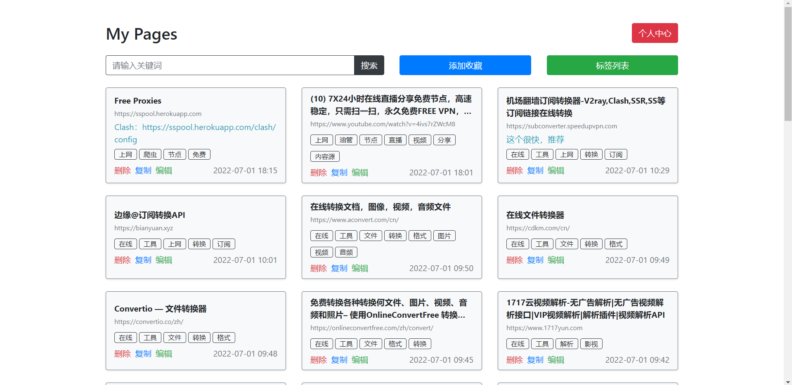
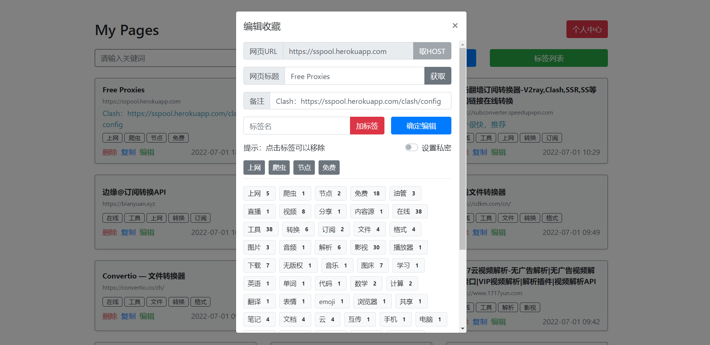
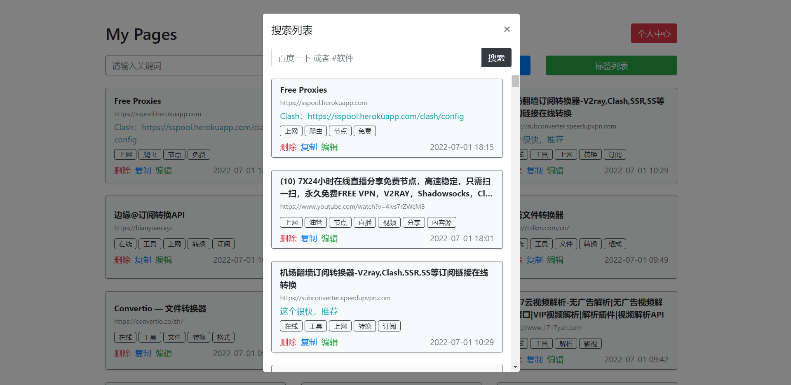
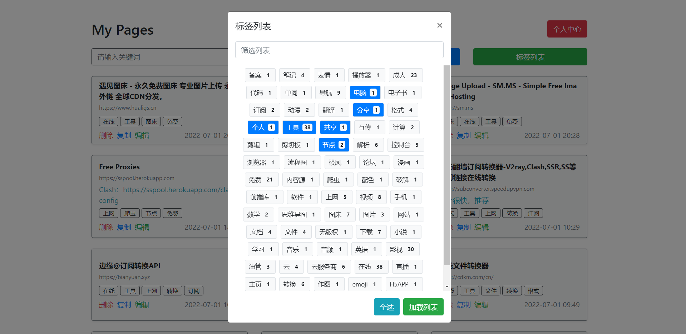
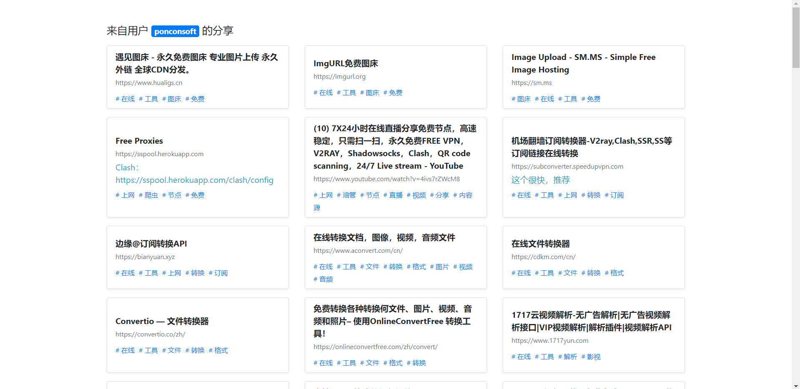

# mypages

一款标签化管理网页收藏的工具

## 开发宗旨

- 简约、轻量、便捷

## 安装说明

- 将 `public` 目录上传到主机
- 复制 `config.default.php` 为 `config.php`
- 将 `config.php` 中的数据库信息填写完整
- 运行 `index.html` 即可

## 项目介绍

当你想要收藏一个网站，而苦恼应该怎么分类的话，你可以尝试使用标签管理法。

对于一个综合型的网站，我们为其打上“影视”、“免费”、“学术”等标签，方便我们随性标记和下次方便找到。

我们平台推出了“标签精确匹配方法”，你可以按照不同的标签组合匹配出更加符合要求的记录，也提高了标签的复用性。

我们可以采用“联想法”去定义我们的标签序列，因为一般情况下，我们会输入我们联想到的关键词去匹配结果，我们将最容易联想的关键词作为标签，附与我们的收藏记录中，并且我们要求标签的定义需要遵从精简的原则，比如“编程教程视频”，我们需要拆解为“编程”、“教程”、“视频”，方便我们下次匹配如“搞笑+视频”、“编程+视频”这样的组合。

如果一次联想不能让我们定义出满意的标签序列，在我们下一次匹配某条记录时，可以根据匹配情况对该记录的标签系列进行编辑，以增加下次匹配的正确性。

我们在搜索模块上，分为了全局搜索和标签匹配，前者会按照记录的标题、URL 、标签、备注进行综合搜索，而后者是按照指定的标签组合进行精准匹配，我们可以结合两种方法，不断完善我们各自的标签系统。

我们平台支持增加收藏记录、定义标签序列、记录随时可编辑、主页共享、多功能搜索等功能。

我们的这套方法，会随着我们收藏记录和标签数量的增加而更加贴合我们的使用习惯，让我们从此解放大脑，随性收藏，不再错过精彩内容。

## 功能

- 用户登录注册
- 添加URL收藏，一键获取title，并支持设置标签
- 整体列表按时间排序，可按标签筛选列表
- 可随时编辑和删除收藏记录
- 根据收藏列表自动生成标签列表，用户可多选标签进行一次性加载
- 可生成个人收藏页，不显示私密部分（bata）
- 主页上显示完整收藏列表，列表项上包含标签
- 单击按钮弹出模态框，可以新增收藏
- 点击列表中的标签，弹出模态框加载该标签（bata）
- 不支持重复URL

### 待改进

- 接入微信公众号用户系统
- 标签筛选列表改为数量排序
- 标签筛选时自动滚动滚动条

### 标签定义规则推荐

- 标签能拆解的，尽量拆解，比如 `编程教程`，拆成 `编程` + `教程`
- 对于实在不能拆解的，需保留，比如 `搜索引擎` 不能拆成 `搜索` + `引擎`
- 这样一来，可以最大限度减少标签数量，提高标签复用性和筛选效率

## 关于

- 作者：欧阳鹏
- 个人主页：https://ouyangpeng.top
- 一直在努力学习和探索中，欢迎关注我~

## 示意图

